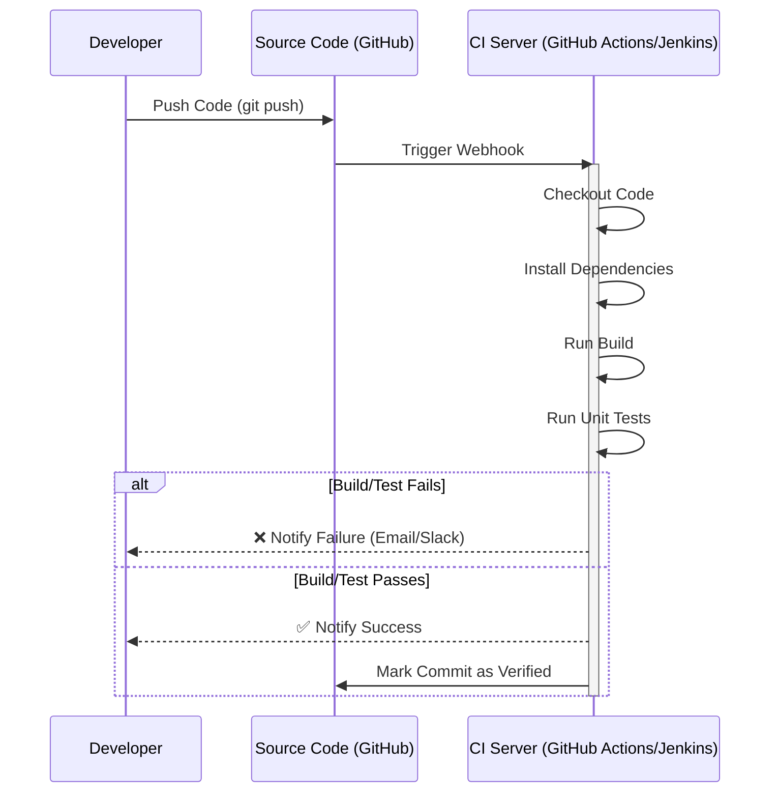
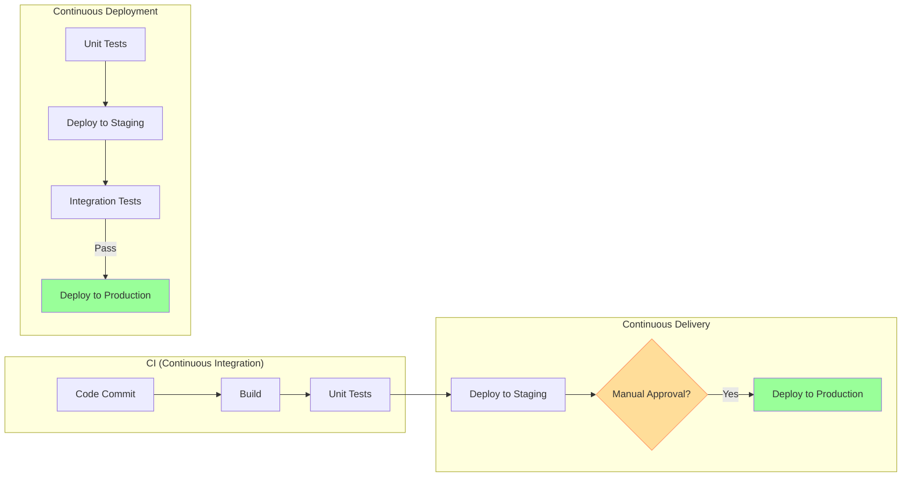
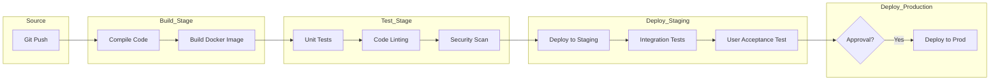
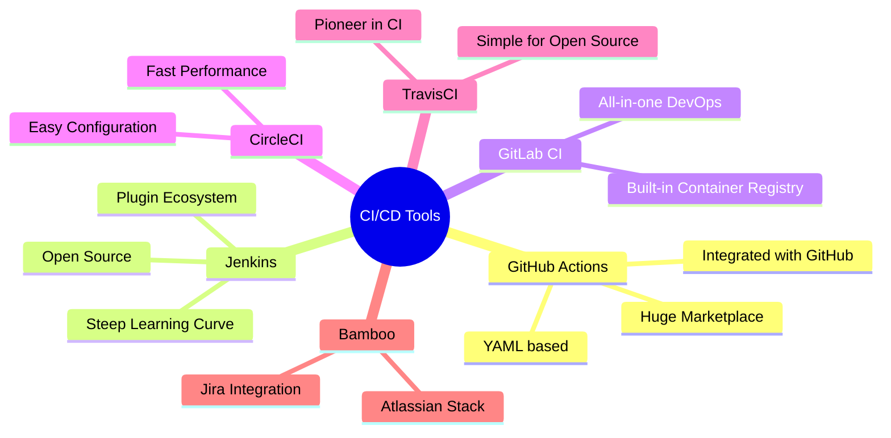
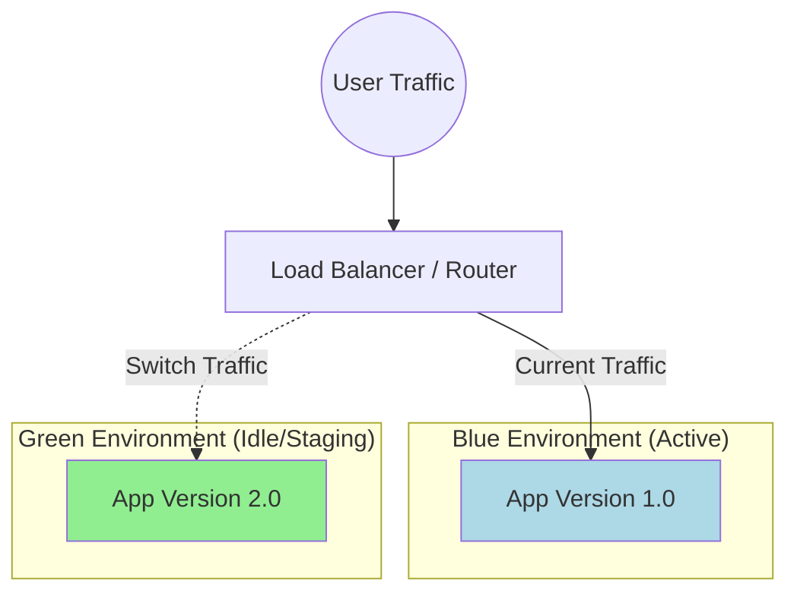
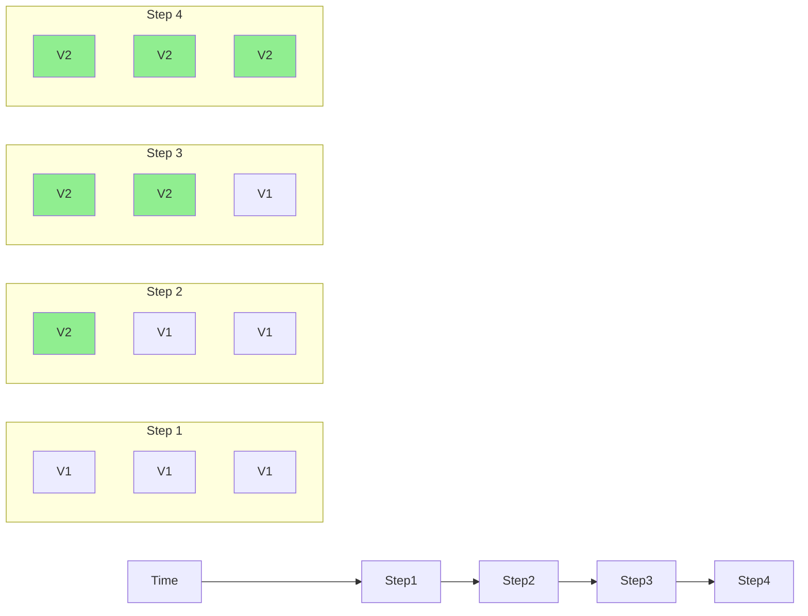

# CI/CD: A Comprehensive Guide

## 1. Introduction to CI/CD

**CI/CD** stands for **Continuous Integration** and **Continuous Delivery/Deployment**. It is a set of operating principles and practices that enable application development teams to deliver code changes more frequently and reliably.

In the modern DevOps landscape, CI/CD is the backbone of software delivery, automating the process of building, testing, and deploying applications.

### Why it Matters
- **Speed**: Faster time to market.
- **Quality**: Automated testing catches bugs early.
- **Reliability**: Consistent deployment processes reduce errors.
- **Collaboration**: Reduces integration conflicts in teams.

---

## 2. Traditional vs. Modern Development

Before CI/CD, software development was often a manual, error-prone process.

### Traditional Development (The "Waterfall" Era)
- **Manual Builds**: Developers manually compiled code.
- **Late Testing**: Testing happened only after all development was "complete".
- **Integration Hell**: Merging code from multiple developers at the end of a cycle caused massive conflicts.
- **Slow Releases**: Deployments happened weeks or months apart.
- **Fear of Deployment**: Deployments were risky and often broke production.

### Modern Development (CI/CD)
- **Automated Builds**: Code is built automatically on every commit.
- **Continuous Testing**: Tests run constantly.
- **Continuous Integration**: Code is merged frequently (daily or hourly).
- **Fast Releases**: Deployments can happen multiple times a day.
- **Confidence**: Automated checks ensure safety.

```mermaid
graph TB
    subgraph "Traditional Development"
        A[Dev writes code] --> B[Wait for weeks]
        B --> C[Manual Merge]
        C --> D{Integration Conflicts?}
        D -- Yes --> E[Fix Conflicts (Days)]
        D -- No --> F[Manual Build]
        F --> G[Manual Test]
        G --> H[Manual Deploy]
    end

    subgraph "CI/CD Approach"
        AA[Dev writes code] --> BB[Push to Repo]
        BB --> CC[Automated CI Pipeline]
        CC --> DD[Build & Test]
        DD --> EE[Automated Deploy]
    end

    style A fill:#ffcccc
    style B fill:#ffcccc
    style C fill:#ffcccc
    style D fill:#ffcccc
    style E fill:#ffcccc
    style F fill:#ffcccc
    style G fill:#ffcccc
    style H fill:#ffcccc

    style AA fill:#ccffcc
    style BB fill:#ccffcc
    style CC fill:#ccffcc
    style DD fill:#ccffcc
    style EE fill:#ccffcc
```

---

## 3. Continuous Integration (CI)

**Continuous Integration (CI)** is the practice of automating the integration of code changes from multiple contributors into a single software project.

### Key Concepts
- **Version Control**: All code lives in a central repository (like GitHub).
- **Automated Build**: The system compiles the code to ensure it's valid.
- **Automated Testing**: Unit tests and integration tests run to verify logic.
- **Early Detection**: If a build fails, the developer is notified immediately.



---

## 4. Continuous Delivery vs. Continuous Deployment (CD)

The "CD" in CI/CD can mean two different things depending on the level of automation.

### Continuous Delivery
- Automates the release process up to the point of deployment.
- **Staging**: Code is automatically deployed to a staging environment.
- **Manual Approval**: A human must approve the final deployment to Production.
- **Use Case**: Regulated industries (Banking, Healthcare) where sign-off is legally required.

### Continuous Deployment
- Fully automates the entire pipeline.
- **No Human Intervention**: If tests pass, the code goes straight to Production.
- **Speed**: The fastest way to get features to users.
- **Use Case**: SaaS products, e-commerce, social media platforms.



---

## 5. The Complete CI/CD Pipeline

A typical pipeline consists of several distinct stages.

1. **Source**: Developer commits code.
2. **Build**: Compile code, build docker images, create artifacts (JAR, EXE, etc.).
3. **Test**: Run unit tests, code quality checks (linting), and security scans.
4. **Staging**: Deploy to a pre-production environment that mimics production.
5. **Production**: Deploy to the live environment for end users.



---

## 6. CI/CD Tools Ecosystem

There are many tools available, but they generally fall into a few categories.

- **Cloud-Native**: GitHub Actions, GitLab CI (Integrated with repo).
- **Self-Hosted/Traditional**: Jenkins (Highly customizable, open source).
- **SaaS Providers**: CircleCI, TravisCI (Easy setup, managed infrastructure).



---

## 7. Deployment Strategies

How you deploy is just as important as what you deploy. Different strategies help minimize downtime and risk.

### A. Blue-Green Deployment
- **Concept**: Maintain two identical environments (Blue and Green).
- **Blue**: Current live version.
- **Green**: New version.
- **Switch**: Once Green is tested and ready, the router/load balancer switches all traffic from Blue to Green instantly.
- **Rollback**: Instant. Just switch the router back to Blue.



### B. Canary Deployment
- **Concept**: Roll out the update to a small subset of users (the "canaries") first.
- **Process**: 
    1. Deploy V2 to 5% of users.
    2. Monitor for errors.
    3. If safe, increase to 25%, then 50%, then 100%.
- **Benefit**: Limits the blast radius of a bad deployment.

```mermaid
graph TB
    Users((All Users))
    LB[Load Balancer]
    
    subgraph "Production Pool"
        S1[Server 1 (V1)]
        S2[Server 2 (V1)]
        S3[Server 3 (V1)]
        S4[Server 4 (V2 - Canary)]
    end

    Users --> LB
    LB -->|95% Traffic| S1
    LB -->|95% Traffic| S2
    LB -->|95% Traffic| S3
    LB -->|5% Traffic| S4
    
    style S4 fill:#ffff99,stroke:#f96
```

### C. Rolling Deployment
- **Concept**: Update instances one by one (or in batches).
- **Process**: 
    1. Take Server 1 offline.
    2. Update Server 1 to V2.
    3. Bring Server 1 back online.
    4. Repeat for Server 2, 3, etc.
- **Benefit**: Zero downtime without needing double the infrastructure (like Blue-Green).



---

## 8. Best Practices & Summary

### Best Practices
1. **Commit Early and Often**: Smaller changes are easier to debug.
2. **Fix Broken Builds Immediately**: The pipeline must always be green.
3. **Keep Builds Fast**: Developers shouldn't wait hours for feedback.
4. **Test in Production-like Environments**: Staging should mirror production.
5. **Immutable Infrastructure**: Don't patch servers; replace them.

### Summary
CI/CD is not just tools; it's a culture of automation. By implementing a robust pipeline with strategies like Blue-Green or Canary deployments, organizations can achieve:
- **High Velocity**: Deploying multiple times a day.
- **High Stability**: Automated tests catch bugs before users do.
- **Happy Teams**: Less time fighting fires, more time building features.
