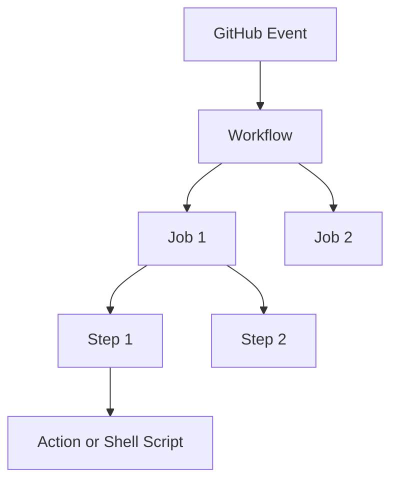

# 01: Introduction to GitHub Actions

## What is GitHub Actions?

**GitHub Actions** is a continuous integration and continuous delivery (CI/CD) platform that allows you to automate your build, test, and deployment pipeline. You can create workflows that build and test every pull request to your repository, or deploy merged pull requests to production.

GitHub Actions goes beyond just DevOps and lets you run workflows when other events happen in your repository. For example, you can run a workflow to automatically add the appropriate labels whenever someone creates a new issue in your repository.

## Why Use GitHub Actions?

1.  **Fully Integrated**: No need for third-party tools like Jenkins or Travis CI. It's built right into GitHub.
2.  **Free for Public Repos**: Generous free tier for private repos and unlimited for public ones.
3.  **Cross-Platform**: Run workflows on Windows, Linux, and macOS.
4.  **Huge Marketplace**: Thousands of pre-built actions created by the community.
5.  **Matrix Builds**: Test across multiple versions of languages and OSs simultaneously.

## Core Components

-   **Workflow**: An automated process that you add to your repository. Workflows are made up of one or more jobs and can be triggered by an event.
-   **Event**: A specific activity in a repository that triggers a workflow run. (e.g., push, pull request, issue creation).
-   **Job**: A set of steps in a workflow that is executed on the same runner.
-   **Step**: An individual task that can run commands or actions.
-   **Action**: A standalone application for the GitHub Actions platform that performs a complex but frequently repeated task.
-   **Runner**: A server that runs your workflows when they are triggered.

## Visualizing the Flow

> [!TIP]
> Think of GitHub Actions as a "Digital Robot" that lives in your repository and performs tasks for you whenever something happens!
