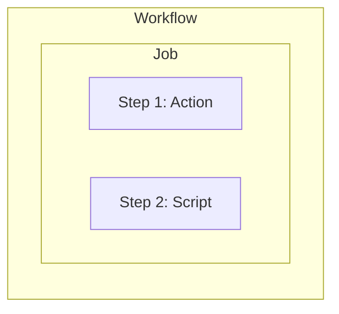
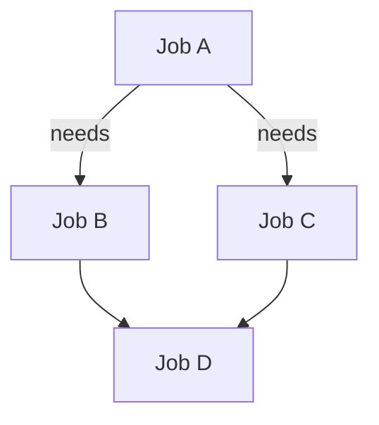

# 02: Core Concepts & Architecture

To master GitHub Actions, you must understand the hierarchy of its components.

## 1. The Workflow hierarchy

A **Workflow** is the top-level container. It lives in your repository at `.github/workflows/`.

### 🏗️ Workflow Structure


## 2. Detailed Component Breakdown

### A. Events (Triggers)
Workflows start with an `on` keyword.
- **Push**: `on: [push]`
- **Pull Request**: `on: [pull_request]`
- **Schedule (Cron)**: `on: schedule: - cron: '0 0 * * *'`
- **Manual**: `on: [workflow_dispatch]`

### B. Jobs
Jobs are a series of steps that run on the same **Runner**. By default, jobs run in **parallel**, but you can make them depend on each other using `needs`.

### C. Steps
Steps are individual tasks. They can:
1. Run a shell command (e.g., `npm install`).
2. Run an **Action** (e.g., `actions/checkout@v4`).

### D. Actions
Actions are reusable units of code. You can find them in the GitHub Marketplace.
Example: `uses: actions/setup-node@v4`

### E. Runners
A runner is a virtual machine or container.
- **GitHub-hosted runners**: Managed by GitHub (Ubuntu, Windows, macOS).
- **Self-hosted runners**: Your own servers.

## 3. Dependency Graph

If you want Job B to run only after Job A finishes:

```yaml
jobs:
  job_a:
    runs-on: ubuntu-latest
    steps:
      - run: echo "Job A"
  job_b:
    needs: job_a
    runs-on: ubuntu-latest
    steps:
      - run: echo "Job B runs after A"
```



> [!IMPORTANT]
> All steps in a single job share the same file system. If Step 1 creates a file, Step 2 can read it. However, Jobs do NOT share a file system unless you use **Artifacts**.
