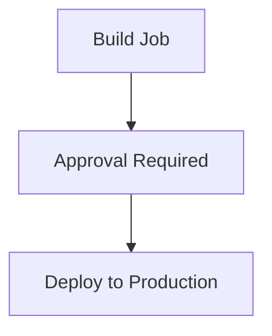

# 04: Advanced GitHub Actions Features

Once you know the basics, these features will make you a pro.

## 1. Secrets and Variables
Store sensitive data (like API keys) in **GitHub Secrets** and non-sensitive config in **Variables**.

Access them like this:
```yaml
steps:
  - name: Deploy
    env:
      API_KEY: ${{ secrets.DEPLOYMENT_KEY }}
      APP_NAME: ${{ vars.APP_NAME }}
    run: ./deploy.sh
```

## 2. Matrix Builds
Test multiple versions of a language or multiple OSs at once.

```yaml
jobs:
  test:
    runs-on: ubuntu-latest
    strategy:
      matrix:
        node: [16, 18, 20]
        os: [ubuntu-latest, windows-latest]
    steps:
      - uses: actions/setup-node@v4
        with:
          node-version: ${{ matrix.node }}
```
*This will trigger 3 x 2 = 6 jobs total!*

## 3. Reusable Workflows
Don't repeat yourself. Create a workflow once and call it from others.

**Caller Workflow:**
```yaml
jobs:
  call-workflow:
    uses: ./.github/workflows/reusable.yml
```

## 4. Caching Dependencies
Speed up your builds by caching `node_modules` or other dependencies.

```yaml
- name: Cache dependencies
  uses: actions/cache@v4
  with:
    path: ~/.npm
    key: ${{ runner.os }}-node-${{ hashFiles('**/package-lock.json') }}
```

## 5. Artifacts
Pass data between jobs or upload build results.

```yaml
- name: Upload Build
  uses: actions/upload-artifact@v4
  with:
    name: build-output
    path: dist/
```

## 6. Environments and Protection Rules
- **Environments**: Define `production`, `staging`, etc.
- **Approvals**: Require manual approval before deploying to certain environments.
- **Wait Times**: Add delays before execution.



> [!TIP]
> Use **Matrix Builds** to save time and ensure your code works everywhere!
